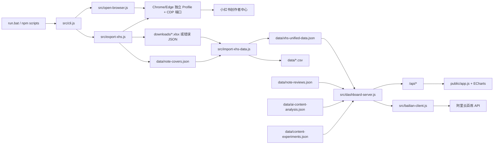

# xhs-data-exporter 项目结构与排障地图

> 最后核对：2026-06-23，提交 `7557aa6`  
> 用途：这是项目级事实入口。排查问题、修改功能或评审影响范围前，先阅读本文，再进入具体源码。

## 1. 项目定位

这是一个 Windows 优先的本地小红书创作者数据工具，主流程是：

1. 启动带远程调试端口的 Chrome/Edge，并复用独立登录态。
2. 使用 Playwright 连接浏览器，在创作者中心逐条导出 Excel。
   也可从用户 Profile 真实点击作品卡片，导出图文、视频、字幕和详情元数据。
3. 解析下载文件，统一指标字段并生成 JSON/CSV 数据库。
4. 通过 Express 提供本地 API 和静态仪表盘。
5. 保存人工复盘标签，并可调用阿里云百炼模型生成封面分析和内容策略。

技术栈：

- Node.js，CommonJS，无 TypeScript、无前端构建步骤。
- Playwright Core：浏览器自动化和下载捕获。
- XLSX：解析小红书导出的工作簿。
- Express 5：本地 API 和静态文件服务。
- ECharts：浏览器端图表。
- 阿里云百炼 OpenAI 兼容接口：封面视觉分析和策略建议。

## 2. 总体数据流



关键边界：

- `downloads/` 是原始输入；`data/xhs-unified-data.json` 是仪表盘的主数据源。
- 人工复盘、AI 分析和内容实验卡片分别独立保存在 `note-reviews.json`、`ai-content-analysis.json`、`content-experiments.json`，重新导入原始数据不会覆盖它们。
- 前端不直接读磁盘，只通过 `src/dashboard-server.js` 暴露的 API 获取和保存数据。
- `data/`、`downloads/`、`logs/`、浏览器 Profile 均为运行时产物，不纳入 Git。

## 3. 目录结构

```text
xhs-data-exporter/
├─ .codex/
│  └─ skills/xhs-project-troubleshooting/  # 项目级排障 Skill
├─ docs/
│  └─ PROJECT_STRUCTURE.md                 # 本文，排障第一入口
├─ public/
│  ├─ index.html                           # 仪表盘页面结构
│  ├─ styles.css                           # 全部页面样式和响应式布局
│  ├─ app.js                               # 前端状态、渲染、交互、API 调用
│  └─ content-diagnostics.js               # 可在浏览器和 Node 中运行的规则诊断
├─ src/
│  ├─ cli.js                               # 统一命令入口与完整工作流编排
│  ├─ config.js                            # config.json、环境变量、路径归一化
│  ├─ env.js                               # 轻量 .env 加载器
│  ├─ browser-path.js                      # 查找 Chrome/Edge 可执行文件
│  ├─ open-browser.js                      # 启动独立 Profile 和 CDP 端口
│  ├─ playwright-utils.js                  # 文本定位、等待、文件快照等工具
│  ├─ export-xhs.js                        # 页面遍历、下载、重试、封面采集
│  ├─ export-profile.js                    # Profile 卡片点击、详情与媒体导出
│  ├─ inspect-page.js                      # 输出当前页面可点击元素，辅助修选择器
│  ├─ metric-field-mapping.js              # 指标规范名、别名与字段 ID
│  ├─ import-xhs-data.js                   # Excel 解析、合并、派生指标、生命周期
│  ├─ note-review-store.js                 # 人工复盘标签存储
│  ├─ content-strategy.js                  # 统计事实、分位数和证据目录
│  ├─ profile-transcript.js                 # Profile 中文字幕关联与 SRT 清洗
│  ├─ bailian-client.js                    # 百炼请求、模型输出校验
│  ├─ ai-analysis-store.js                 # AI 分析结果存储
│  ├─ content-experiment-store.js          # 内容实验卡片与验证匹配存储
│  └─ dashboard-server.js                  # Express API 与静态站点
├─ test/
│  ├─ metric-field-mapping.test.js
│  ├─ content-diagnostics.test.js
│  ├─ content-strategy.test.js
│  ├─ note-review-store.test.js
│  └─ content-experiment-store.test.js
├─ data/                                   # 运行时统一数据、复盘、AI 结果、截图
├─ downloads/                              # 小红书原始导出文件
├─ logs/                                   # 导出和仪表盘日志
├─ config.json                             # 浏览器、页面文本、重试和上限配置
├─ .env.example                            # 百炼环境变量模板
├─ package.json                            # 命令与依赖
└─ run.bat                                 # Windows 用户入口
```

## 4. 入口与命令

| 命令 | 实际入口 | 作用 |
|---|---|---|
| `run.bat` | `src/cli.js` | 交互菜单 |
| `run.bat full` | `cli.js` | 浏览器确认 → 全量导出 → 导入 → 仪表盘 |
| `run.bat test` | `cli.js` | 仅处理 1 条笔记的完整流程 |
| `run.bat browser` / `npm run browser` | `open-browser.js` | 打开专用浏览器 |
| `npm run export` | `export-xhs.js` | 仅执行页面导出 |
| `npm run export:profile` | `export-profile.js` | 从 Profile 模拟点击作品并导出媒体与元数据 |
| `npm run import` | `import-xhs-data.js` | 仅重建统一数据 |
| `npm run dashboard` | `dashboard-server.js` | 启动本地仪表盘 |
| `npm run inspect` | `inspect-page.js` | 检查页面可点击元素 |
| `npm test` | `test/*.test.js` | 顺序执行单元测试 |

注意：`run.bat export` 与 `npm run export` 不完全相同。前者由 CLI 编排，导出成功后还会执行导入；后者只运行 `export-xhs.js`。

## 5. 后端模块职责与调用关系

### 5.1 启动与浏览器层

- `src/cli.js`
  - 检查 `node_modules`，缺失时运行 `npm install`。
  - 检查 `http://127.0.0.1:<debugPort>/json/version` 判断专用浏览器是否存在。
  - 编排导出、导入、仪表盘启动。
  - 后台启动仪表盘时写入 `logs/dashboard.log`。
- `src/config.js`
  - 合并内置默认值、根目录 `config.json` 和 `XHS_*` 环境变量。
  - 将 `downloadDir` 转为绝对路径并确保目录存在。
- `src/open-browser.js`
  - 使用 `.chrome-profile-<debugPort>` 保存登录态。
  - 当前 `config.json` 使用调试端口 `9333`；源码默认值是 `9222`。
- `src/browser-path.js`
  - 优先读取 `CHROME_PATH`，否则搜索常见 Chrome/Edge 安装目录。

### 5.2 页面导出层

- `src/export-profile.js`
  - 只直接打开 Profile 页面，不直接拼接或访问作品详情 URL。
  - 对每篇作品点击 Profile 中真实可见的封面卡片，由页面生成带 `xsec_token` 的详情链接。
  - 读取该次点击触发的详情响应，保存正文、发布时间、互动数、标签、图文/视频类型。
  - 视频优先下载最高分辨率 H.264 流，同时下载图片和字幕。
  - 输出到 `profile-exports/<序号>-<noteId>-<标题>/`，总清单为 `profile-exports/manifest.json`。
- `src/export-xhs.js`
  - 通过 `chromium.connectOverCDP()` 连接已打开的浏览器。
  - 按 `detailTexts` 找到笔记详情入口。
  - 按 `exportTexts` 点击一个或多个导出按钮。
  - 同时监听 Playwright download 事件和下载目录变化，以兼容不同下载行为。
  - 分页优先按 `nextPageTexts` 文本定位；无文字的新版分页控件会回退识别右箭头图标。
  - 将文件重命名为：

    ```text
    <四位导出序号>-<按钮序号>-<时间戳>-<原文件名>
    ```

  - JSON 中 `success: false` 被视为导出失败，并按配置重试。
  - 从详情页采集封面 URL，写入 `data/note-covers.json`。
  - 每次运行写 `logs/export-<ISO 时间>.log`。
- `src/playwright-utils.js`
  - 负责按多个文本查找可见元素、等待、文件目录快照和安全文件名。
  - 超长下载文件名会裁剪标题部分，但保留“数据明细表”和 `.xlsx`/`.json` 扩展名。
- `src/inspect-page.js`
  - 当小红书改版或按钮文案变化时，用它确认真实可点击文本，再更新 `config.json`。

### 5.3 数据导入层

- `src/metric-field-mapping.js`
  - 所有官方指标名称和别名的唯一映射入口。
  - 返回 canonical 名称、英文 ID、basic/interaction 类型和匹配方式。
- `src/import-xhs-data.js`
  - 只识别符合命名规则并以“数据明细表”结尾的 `.xlsx`/`.json`。
  - 同一“标题 + basic/interaction”只取修改时间最新的文件。
  - 按按钮序号区分：
    - `1`：基础数据。
    - 其他：互动数据。
  - 将总览、日粒度、小时粒度工作表解析为统一结构。
  - 计算互动量、CES、观看曝光比、互动率、收藏率、评论率、分享率、转粉率。
  - 生成 1h、6h、24h、3d、7d、14d 生命周期里程碑，并标注 `complete`、`partial`、`missing`。
  - 输出：
    - `data/xhs-unified-data.json`：必需主数据库。
    - `data/notes.csv`：笔记摘要。
    - `data/daily_metrics.csv`：日指标。
    - `data/hourly_metrics.csv`：小时指标。
  - `fieldMapping` 中记录别名匹配、未识别字段和缺失必需字段。

### 5.4 仪表盘与存储层

- `src/dashboard-server.js`
  - 默认监听 `5178`，可用 `XHS_DASHBOARD_PORT` 修改。
  - 若主数据不存在，`GET /api/data` 会触发一次导入；主数据存在时直接读取，不自动扫描新下载文件。
  - 将统一数据与人工复盘、AI 分析结果、内容实验卡片组合后返回前端。
- `src/note-review-store.js`
  - 以 `noteKey` 保存人工标签、系列、前 5 秒结构和备注。
  - 自定义选项会被持久化，并与默认选项合并。
- `src/ai-analysis-store.js`
  - 以 `noteKey` 合并保存封面分析、输入文本和策略结果。
- `src/content-experiment-store.js`
  - 保存从 AI 建议启动的内容实验卡片，并在导入新数据后按人工选择的 `noteKey` 记录验证快照。
- `src/content-strategy.js`
  - 计算目标笔记在账号内部的 Q1、中位数、Q3、分位排名。
  - 生成可引用的 evidence ID，限制模型只能使用已计算事实。
- `src/profile-transcript.js`
  - 按统一数据中的标题/`noteKey` 关联 `profile-exports/manifest.json`。
  - 优先读取对应作品的 `subtitle-zh-CN-*.srt`，移除字幕序号和时间轴，并用中文逗号连接字幕段落。
  - 找不到中文字幕时读取同目录 `metadata.json.description`，作为“原文案 / 图文正文”回填。
  - 策略详情 API 将结果作为 `automaticTranscript` 或 `automaticCaption` 返回；前端优先回填，没有时才使用历史手工输入。
- `src/bailian-client.js`
  - 从 `.env`/环境变量读取模型配置。
  - 封面分析先尝试把远程图片转为 data URL，失败时回退原 URL。
  - 策略建议最多保留 3 条，并过滤不存在的 evidence ID。

## 6. API 路由

| 方法与路径 | 作用 | 主要读写 |
|---|---|---|
| `GET /health` | 服务和 AI 配置状态 | 环境变量 |
| `GET /api/data` | 获取装饰后的完整数据 | unified data + reviews + AI + experiments |
| `POST /api/import` | 重新扫描下载目录并导入 | 写 unified data/CSV |
| `POST /api/note-reviews` | 保存某篇笔记的人工复盘 | 写 `note-reviews.json` |
| `GET /api/content-strategy/:noteKey` | 获取规则事实、自动中文字幕、缓存分析和模型状态 | 读主数据、Profile 字幕与 AI 缓存 |
| `POST /api/content-strategy/cover` | 调用视觉模型分析封面 | 写 AI 分析 |
| `POST /api/content-strategy/recommend` | 调用文本模型生成下一条建议 | 写 AI 分析 |
| `GET /api/content-experiments` | 获取内容实验卡片 | 读 `content-experiments.json` |
| `POST /api/content-experiments` | 从 AI 建议创建实验卡片 | 写 `content-experiments.json` |
| `PATCH /api/content-experiments/:experimentId/match` | 将导入后的笔记匹配到实验卡片并记录验证快照 | 写 `content-experiments.json` |

静态资源：

- `/` 和 `public/*` 来自 `public/`。
- `/vendor/echarts/*` 映射到 `node_modules/echarts/dist`。

## 7. 前端结构

- `public/index.html`
  - 七个视图：生命周期、发布时间、内容漏斗、封面、笔记横向对比、内容策略、内容实验室。
  - 无框架，依靠固定 DOM ID 和 `data-*` 属性连接 `app.js`。
- `public/app.js`
  - 单一全局 `state` 保存数据、筛选、分页、排序、当前视图和 ECharts 实例。
  - `loadData()` 调用 `/api/data`；“导入新数据”调用 `/api/import`。
  - 所有视图采用命令式 DOM 渲染。
  - 人工复盘、封面 AI、策略 AI、内容实验创建和实验匹配都在此发起 API 请求。
- `public/content-diagnostics.js`
  - UMD 风格，同时暴露给浏览器 `window.ContentDiagnostics` 和 Node 测试。
  - 优先按同系列、同内容类型+形式、同类型、最近 30 篇选择对标样本。
  - 至少需要 3 篇 peer 才输出相对诊断。
- `public/styles.css`
  - 全局样式和移动端响应式规则。修改 DOM class 时必须同步检查这里。

## 8. 主数据结构

`data/xhs-unified-data.json` 顶层：

```text
summary              导入时间、笔记数、文件数、总曝光等
fieldMapping         字段识别状态、别名、缺失字段
notes                每篇笔记的汇总与派生指标
dailyMetrics         日粒度长表
hourlyMetrics        小时粒度长表
lifecycleMilestones  每篇笔记各里程碑的指标与覆盖状态
coverRecords         导出阶段采集的封面记录
importedFiles        本次实际采用的源文件
skippedFiles         未识别、旧重复或错误导出文件
```

服务返回 `/api/data` 时额外加入：

```text
reviewMetadata       人工复盘选项、更新时间、复盘数量
notes[].review       对应 noteKey 的人工复盘
aiAnalysis           以 noteKey 为键的 AI 分析
contentExperiments   AI 方案启动的实验卡片、匹配笔记和验证快照
```

主关联键是 `noteKey`，目前主要由清洗后的小写标题生成。标题变化、重名或导出文件名异常会影响封面、复盘和 AI 结果的关联。

## 9. 配置与秘密

### `config.json`

重点配置：

- `debugPort`：浏览器 CDP 端口。
- `targetUrl`：小红书数据分析页。
- `detailTexts`、`exportTexts`、`closeTexts`、`nextPageTexts`：页面文本定位。
- `maxPages`、`maxNotes`：遍历上限。
- `pageReadyTimeoutMs`、`downloadTimeoutMs`：页面和下载超时。
- `exportRetryCount`、`exportRetryWaitMs`：失败重试。
- `exportAllButtonsInDetail`：是否点击详情页全部导出按钮。

可覆盖的环境变量见 `src/config.js`，包括 `XHS_DEBUG_PORT`、`XHS_MAX_PAGES`、`XHS_MAX_NOTES`、`XHS_EXPORT_ALL_BUTTONS` 和重试参数。

Profile 导出使用：

- `XHS_PROFILE_URL`：目标用户主页。
- `XHS_PROFILE_MAX_NOTES`：本次最多点击的作品数。
- `XHS_PROFILE_DOWNLOAD_MEDIA=false`：只保存详情元数据，不下载媒体。

### `.env`

从 `.env.example` 复制，禁止提交真实密钥：

- `DASHSCOPE_API_KEY`
- `DASHSCOPE_BASE_URL`
- `DASHSCOPE_VISION_MODEL`
- `DASHSCOPE_STRATEGY_MODEL`
- `DASHSCOPE_ASR_MODEL`

## 10. 排障入口矩阵

| 现象 | 先看 | 再检查 |
|---|---|---|
| 找不到 Chrome/Edge | `browser-path.js` | `CHROME_PATH`、浏览器安装路径 |
| 无法连接浏览器 | `open-browser.js`、`config.json` | CDP 端口、Profile、`/json/version` |
| 找不到“详情/导出/下一页” | `inspect-page.js` | 页面登录态、按钮文案、`config.json` |
| 点击后没有文件 | `export-xhs.js` | 最新 export 日志、超时、异步任务、下载权限 |
| 下载得到错误 JSON | `export-xhs.js::failedJsonDownload` | JSON 的 `msg/message/code`、重试配置 |
| 导入笔记数少 | `import-xhs-data.js::latestFiles/parseFileName` | 文件名规则、旧重复、`skippedFiles` |
| 某指标为 0 或缺失 | `metric-field-mapping.js` | `fieldMapping.unrecognizedFields`、工作表名和表头 |
| 生命周期显示不完整 | `buildLifecycleMilestones` | 小时/日数据覆盖范围和 `*Status` |
| 封面没有关联 | `note-covers.json` + importer | 标题生成的 `noteKey` 是否一致 |
| 新下载未出现在仪表盘 | `POST /api/import` | 不能只刷新 `/api/data` |
| 人工标签保存失败 | `/api/note-reviews` | `noteKey`、`data/note-reviews.json` 写权限 |
| 图表或表格错误 | `public/app.js` | `/api/data` 响应、浏览器控制台、DOM ID |
| 相对诊断不出现 | `content-diagnostics.js` | peer 是否达到 3 篇、复盘标签是否可分组 |
| AI 按钮不可用/报错 | `dashboard-server.js`、`bailian-client.js` | `.env`、`/health`、模型名、API 响应 |
| 内容实验卡片或匹配失败 | `content-experiment-store.js`、`/api/content-experiments*` | `noteKey`、`data/content-experiments.json` 写权限、导入后笔记是否存在 |
| 仪表盘无法启动 | `dashboard-server.js` | 5178 端口、`logs/dashboard.log`、依赖 |

## 11. 建议排障顺序

1. 先确认入口和故障层：浏览器、导出、导入、服务、前端、AI。
2. 运行 `git status --short --branch`，避免把用户未提交改动误判为故障。
3. 检查对应运行时产物：
   - 导出：最新 `logs/export-*.log` 和 `downloads/`。
   - 导入：`data/xhs-unified-data.json` 的 `summary`、`fieldMapping`、`skippedFiles`。
   - 服务：`GET /health`、`GET /api/data`、`logs/dashboard.log`。
   - 前端：浏览器控制台、Network、目标 DOM。
4. 从入口沿本文调用链追到最小责任模块，不跨层猜修。
5. 先构造最小复现，再修改代码。
6. 修改后至少运行 `npm test`；涉及真实页面时再执行 `run.bat test` 或 `npm run inspect`。
7. 若模块职责、路由、数据结构、命令或配置发生变化，同步更新本文。

## 12. 测试覆盖与空白

现有测试：

- `metric-field-mapping.test.js`：指标别名、总览合并、时间序列解析。
- `content-diagnostics.test.js`：分位统计、对标组选择、规则诊断。
- `content-strategy.test.js`：账号内事实分位和 evidence catalog。
- `note-review-store.test.js`：复盘保存、自定义选项、重新装饰数据。
- `content-experiment-store.test.js`：实验卡片创建、字段清洗、匹配验证快照。
- `playwright-utils.test.js`：超长导出文件名保留固定后缀和扩展名。
- `profile-transcript.test.js`：SRT 时间轴清洗、标题关联和中文字幕优先读取。

尚无自动化覆盖：

- 真实小红书页面和下载流程。
- `dashboard-server.js` API 集成测试。
- `bailian-client.js` 网络请求和异常路径。
- `public/app.js` DOM/ECharts 交互。
- 完整 Excel 样本到统一数据库的端到端回归。

因此，涉及这些区域时不能只依赖 `npm test`，需要增加针对性的本地验证。

## 13. 维护规则

以下变化必须同步更新本文：

- 新增、删除或重命名入口、核心模块。
- 改变下载文件命名、`noteKey`、主数据结构或落盘文件。
- 新增或修改 API 路由。
- 新增环境变量或重要 `config.json` 配置。
- 改变测试命令或验证流程。

不要把真实 API Key、账号信息、完整业务数据或浏览器 Profile 内容写入本文。
